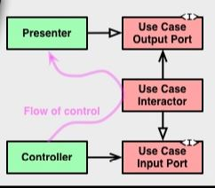

# Using Python Flow of control in Clean Architecture

`Clean Architecture`の右下の図にある`flow of control`について解説し、サンプルコードをPythonで実装してみました。
元々は、DDDをわかりやすく解説している[こちらの記事](https://nrslib.com/clean-flow-of-control/)のサンプルコードをPythonで実装し、自分なりの補足などをまとめた内容です。



`flow of control`とは読んで字のごとく、`「制御の流れ」`という意味で、プログラムの処理の順番のことです。
図で見れば、`Flow of control`は、`Controller -> UseCaseInteractor -> Presenter`の順番で処理が進んでいくことを示しています。

## クラス構成
`flow of control`以外にも`白抜きや黒などの矢印`を指しているものがあります。

矢印は、いわゆる`依存関係`というものを表している図です。
`Controller`は、`UseCaseInputPort`に依存していることを表しています。


## クラスでみる制御の流れ
- 1 : `Controller`が`UseCaseInputPort(interface)`を利用する（メソッドを呼ぶ）
- 2 : `UseCaseInputPort` の実装である `UseCaseInteractor` の処理が実行される
- 3 : `UseCaseInteractor` は処理の結果を `UseCaseOutputPort` に伝える
- 4 : `UseCaseOutputPort` の実装である `Presenter` において、出力が表現される

`Controller -> UseCaseInteractor -> Presenter`という順序で実行されているため、`flow of control`通りの制御の流れになっている。

---

## 実際のソースコード

### Controllerに該当

[interface_adapters/controller.py](./interface_adapters/controller.py)

コンストラクタで、`applications/interfaces/InterfaceUsecaseEditTextInputPort`型のオブジェクトであるinput_portを受け取る。
`applications/interfaces/InterfaceUsecaseEditTextInputPort`は、`flow of control`でいう`UseCaseInputPort`である。

`applications/interfaces/InterfaceUsecaseEditTextInputPort`クラス自体は抽象クラスであり、具体的な実装を持っていない。
input_portで受け取ったオブジェクトは、`applications/interfaces/InterfaceUsecaseEditTextInputPort`を継承した具象オブジェクト。

ちなみに`applications/interfaces/InterfaceUsecaseEditTextInputPort`を継承した具象オブジェクトは、`UseCaseInteractor`のことです。
`execute`メソッドで、`UseCaseInteractor`に該当するオブジェクトの`handle`メソッドを実行していることがわかります。

```python
# from injector import inject
from flow_of_control.applications.interfaces import InterfaceUsecaseEditTextInputPort


class Controller:
    """"""
    input_port: InterfaceUsecaseEditTextInputPort

    # @inject
    def __init__(self, input_port: InterfaceUsecaseEditTextInputPort) -> None:
        self.input_port = input_port

    def execute(self, text_list: list[str]) -> None:
        self.input_port.handle(text_list)
```

### UseCaseInputPortに該当

[applications/interfaces.py](./applications/interfaces.py)

インターフェースに該当するものですが、Pythonにはインターフェースの機能がないため、抽象クラスで再現する。

`applications/interfaces/InterfaceUsecaseEditTextInputPort`型を継承した具象クラスは、**handleメソッドを実装させることを強制**させます。
UseCaseInteractorに該当するクラスに`applications/interfaces/InterfaceUsecaseEditTextInputPort`型を継承させます。

```python
from abc import ABCMeta, abstractmethod


class InterfaceUsecaseEditTextInputPort(metaclass=ABCMeta):
    """"""

    @abstractmethod
    def handle(self, text_list: list[str]) -> None:
        raise NotImplementedError
```

### UseCaseInteractorに該当

[applications/use_cases.py](./applications/use_cases.py)

**ロジックを記述するクラス**です。
`ToCsvUseCaseInteractor`,`ToTsvUseCaseInteractor`のどちらも`applications/interfaces/InterfaceUsecaseEditTextInputPort`を継承していることがわかる。
`flow of control`の`白抜きの矢印`の図は`関連`を表しています。

コンストラクタでは、`applications/interfaces/InterfaceUsecaseEditTextOutputPort`型のオブジェクトである`output_port`を受け取る。
`applications/interfaces/InterfaceUsecaseEditTextOutputPort`は、`flow of control`でいう`UseCaseOutputPort`である。

`applications/interfaces/InterfaceUsecaseEditTextOutputPort`クラス自体も抽象クラスであり、具体的な実装は持っていない。
`output_port`で受け取ったオブジェクトは、`applications/interfaces/InterfaceUsecaseEditTextOutputPort`を継承した具象オブジェクト。

ちなみに`applications/interfaces/InterfaceUsecaseEditTextOutputPort`を継承した具象オブジェクトは、`Presenter`のことです。
`handle`メソッドで、`UseCaseOutputPort`に該当するオブジェクトの`emit`メソッドを実行していることがわかる。

`flow of control`の図でわかる通り、`UseCaseOutputPort`型の抽象クラス(インターフェース)を利用しています。
これによってわかるのは、`UseCaseInteractor`に該当する`ToCsvUseCaseInteractor`,`ToTsvUseCaseInteractor`のどちらも具象クラスには依存していないことがわかる。
あくまでも**抽象クラス(インターフェース)に依存している**ことがわかります。

```python
# from injector import inject
from flow_of_control.applications.interfaces import (
    InterfaceUsecaseEditTextInputPort,
    InterfaceUsecaseEditTextOutputPort
)


class ToCsvUseCaseInteractor(InterfaceUsecaseEditTextInputPort):
    """"""
    output_port: InterfaceUsecaseEditTextOutputPort

    # @inject
    def __init__(self, output_port: InterfaceUsecaseEditTextOutputPort) -> None:
        """"""
        self.output_port = output_port

    def handle(self, text_list: list[str]) -> None:
        """"""

        text: str = ",".join(text_list)
        self.output_port.emit(text)


class ToTsvUseCaseInteractor(InterfaceUsecaseEditTextInputPort):
    """"""
    output_port: InterfaceUsecaseEditTextOutputPort

    # @inject
    def __init__(self, output_port: InterfaceUsecaseEditTextOutputPort):
        self.output_port = output_port

    def handle(self, text_list: list[str]) -> None:
        """"""

        text: str = "\t".join(text_list)
        self.output_port.emit(text)
```

### UseCaseOutputPortに該当

[applications/interfaces.py](./applications/interfaces.py)

インターフェースに該当するものですが、Pythonにはインターフェースの機能がないため、抽象クラスで再現します。

`applications/interfaces/InterfaceUsecaseEditTextOutputPort`型を継承した具象クラスは、**emitメソッドを実装させることを強制**させる。
`Presenter`に該当するクラスに`applications/interfaces/InterfaceUsecaseEditTextOutputPort`型を継承させる。

```python
from abc import ABCMeta, abstractmethod

class InterfaceUsecaseEditTextOutputPort(metaclass=ABCMeta):
    """"""

    @abstractmethod
    def emit(self, text: str) -> None:
        raise NotImplementedError
```


### Presenterに該当

[interface_adapters/presenter.py](./interface_adapters/presenter.py)

- ConsolePresenter
- SaveToFilePresenter

出力部分を表示するクラス。

`UseCaseOutputPort`に該当する`applications/interfaces/InterfaceUsecaseEditTextOutputPort`型を継承している。
`ConsolePresente`rも`SaveToFilePresenter`も抽象クラスである`applications/interfaces/InterfaceUsecaseEditTextOutputPort`に`関連`することになる。

```python
from flow_of_control.applications.interfaces import InterfaceUsecaseEditTextOutputPort


class ConsolePresenter(InterfaceUsecaseEditTextOutputPort):
    """"""

    def emit(self, text: str) -> None:
        print("ConsolePresenter text", text)


class SaveToFilePresenter(InterfaceUsecaseEditTextOutputPort):
    __FILE_PATH: str = "out.txt"

    def emit(self, text: str) -> None:
        file = open(self.__FILE_PATH, 'w')
        file.write(text)
        file.close()

```

## Test Run

```bash
$ pytest -s -v tests
```

## DI Container

```bash
$ pip install injector
```

抽象クラスである`InterfaceUsecaseEditTextOutputPort`と`InterfaceUsecaseEditTextInputPort`の引数に対して、実行時にインスタンスを渡すことが可能になる。これがDIコンテナという機能です。

詳細はこちらになります。

[PythonでのDependency Injection 依存性の注入](https://qiita.com/mkgask/items/d984f7f4d94cc39d8e3c#injector)

```python
from injector import Injector, Module, Binder

from flow_of_control.interface_adapters.presenter import ConsolePresenter
from flow_of_control.interface_adapters.controller import Controller

from flow_of_control.applications.interfaces import(
    InterfaceUsecaseEditTextInputPort,
    InterfaceUsecaseEditTextOutputPort
)
from flow_of_control.applications.use_cases import ToCsvUseCaseInteractor


class DIContainer(Module):
    def configure(self, binder: Binder):
        binder.bind(InterfaceUsecaseEditTextOutputPort, to=ConsolePresenter)
        binder.bind(InterfaceUsecaseEditTextInputPort, to=ToCsvUseCaseInteractor)


injector: Injector = Injector([DIContainer()])
controller: Controller = injector.get(Controller)
controller.execute(["source", "data", "foo", "bar"])
```


## 参考資料

- [クリーンアーキテクチャの右下の図](https://nrslib.com/clean-flow-of-control/)
